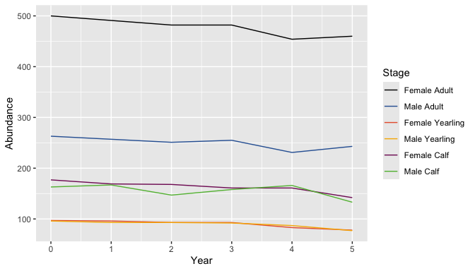
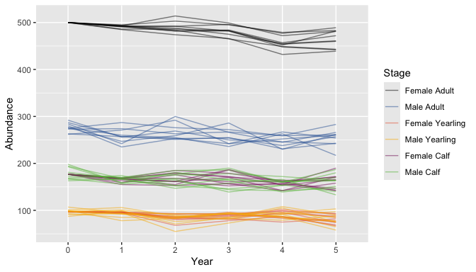

<!-- README.md is generated from README.Rmd. Please edit that file -->

# bbousims

<!-- badges: start -->

[](https://lifecycle.r-lib.org/articles/stages.html#experimental)
[](https://github.com/poissonconsulting/bbousims/actions/workflows/R-CMD-check.yaml)
[](https://app.codecov.io/gh/poissonconsulting/bbousims?branch=main)
<!-- badges: end -->

`bbousims` is a package to simulate Boreal Caribou population abundance
over time from survival, ageing and birth processes. Survival and
recruitment data from hypothetical composition surveys and collaring are
simulated from key sampling parameters.

The output of `bbs_simulate_caribou()` is intended to be used as input
data for [bboutools](https://poissonconsulting.github.io/bboutools/)
functions for fitting survival and recruitment models and predicting
population growth.

In addition, there is more general functionality for simulating
population abundance given any set of stages, period duration, and
survival, ageing and birth process matrices.

## Installation

You can install the development version of bbousims from
[GitHub](https://github.com/) with:

``` r
# install.packages("remotes")
remotes::install_github("poissonconsulting/bbousims")
```

## Introduction

### Simulate survival and fecundity rates

Simulate survival rates for each month, year and stage and fecundity
rates for each year and stage. Rates are generated for female stages
(female calf, female yearling and female adult). Female calf and female
adult survival rates are specified from separate linear models, whereas
female yearling survival is specified as an effect on female adult
survival.

``` r
set.seed(1)
survival <- bbs_survival_caribou(
  survival_adult_female = 0.85,
  annual_sd_adult_female = 0.2,
  trend_adult_female = -0.1,
  month_sd_adult_female = 0.1,
  survival_calf_female = 0.5,
  yearling_effect = 0.05,
  nyear = 5
)

fecundity <- bbs_fecundity_caribou(
  calves_per_adult_female = 0.7,
  annual_sd = 0.1,
  nyear = 5
)
```

View expected monthly survival rates (‘eSurvival’) for adult females
(stage 3) by each month and year.

``` r
survival$eSurvival[, , 3]
#>            [,1]      [,2]      [,3]      [,4]      [,5]
#>  [1,] 0.9834999 0.9844767 0.9790802 0.9856860 0.9797460
#>  [2,] 0.9854934 0.9863539 0.9815977 0.9874188 0.9821849
#>  [3,] 0.9858478 0.9866875 0.9820455 0.9877267 0.9826186
#>  [4,] 0.9856192 0.9864723 0.9817566 0.9875280 0.9823388
#>  [5,] 0.9843153 0.9852446 0.9801095 0.9863948 0.9807433
#>  [6,] 0.9868873 0.9876661 0.9833596 0.9886298 0.9838915
#>  [7,] 0.9853533 0.9862219 0.9814206 0.9872969 0.9820133
#>  [8,] 0.9838201 0.9847783 0.9794844 0.9859644 0.9801376
#>  [9,] 0.9810780 0.9821956 0.9760254 0.9835796 0.9767862
#> [10,] 0.9863772 0.9871859 0.9827146 0.9881866 0.9832668
#> [11,] 0.9847123 0.9856185 0.9806110 0.9867400 0.9812291
#> [12,] 0.9847556 0.9856591 0.9806656 0.9867775 0.9812819
```

### Project population

Population is projected from survival and fecundity rates. Survival
occurs at the end of each month and survival, ageing and birth occur at
the end of each year, in that order.

Initial population abundance for each stage is determined from the
initial number of adult females set by the user and the calculated
stable stage distribution (see `bbs_demographic_summary()` for details).
Population abundance for male stages are based on user-provided sex
ratios.

``` r
set.seed(1)
population <- bbs_population_caribou(survival,
  fecundity = fecundity,
  adult_females = 500,
  proportion_adult_female = 0.65
)
```

The output is a matrix with abundance for each period and stage. The
first period is the initial population and period 13 is the final month
of the first year.

``` r
# projected population for first year
population[, 1:13]
#>      [,1] [,2] [,3] [,4] [,5] [,6] [,7] [,8] [,9] [,10] [,11] [,12] [,13]
#> [1,]  177  169  155  142  138  129  122  116  112   107   102    97   180
#> [2,]  163  167  143  138  142  138  119  128  108   114   120   101   180
#> [3,]   97   96   96   94   94   93   91   89   87    86    84    83    94
#> [4,]   96   93  104  102   91  102   90   99   96    84    93    76    97
#> [5,]  500  491  480  473  469  460  447  436  432   429   424   418   492
#> [6,]  263  257  273  237  239  259  238  245  225   252   234   228   271
```

``` r
bbs_plot_population(population)
```

<!-- -->

### Simulate abundance, survival and recruitment data

Abundance, survival and recruitment data are simulated from hypothetical
composition surveys and collaring, given the survival and fecundity
rates used to project the population and a set of key sampling
parameters. The output is a list of lists of the abundance, survival,
and recruitment data.frames for each simulation.

``` r
set.seed(1)
data <- bbs_simulate_caribou(
  survival = survival,
  fecundity = fecundity,
  nsims = 10,
  adult_females = 500,
  proportion_adult_female = 0.65,
  month_composition = 9L,
  collared_adult_females = 30,
  group_size = 6,
  group_coverage = 0.3
)
```

``` r
bbs_plot_population(data)
```

<!-- -->

View collar survival data for the first simulation

``` r
# collar survival data for first simulation
print(data[[1]]$survival)
#> # A tibble: 60 × 6
#>     Year Month PopulationName StartTotal MortalitiesCertain MortalitiesUncertain
#>    <int> <int> <chr>               <dbl>              <int>                <int>
#>  1     1     1 A                      30                  1                    0
#>  2     1     2 A                      29                  0                    0
#>  3     1     3 A                      29                  2                    0
#>  4     1     4 A                      27                  1                    0
#>  5     1     5 A                      26                  0                    0
#>  6     1     6 A                      26                  0                    0
#>  7     1     7 A                      26                  1                    0
#>  8     1     8 A                      25                  0                    0
#>  9     1     9 A                      25                  0                    0
#> 10     1    10 A                      25                  0                    0
#> # ℹ 50 more rows
```

### Work with `bboutools`

The survival and recruitment data.frames in the output of
`bbs_simulate_caribou()` are intended to be used as input data for model
fitting functions in the [bboutools
package](%22https://poissonconsulting.github.io/bboutools/).

``` r
# fit model for each simulation
# we set year_start = 1 because we assume the projected population is for the biological year
fits <- lapply(1:length(data), function(x) {
  survival <- data[[x]]$survival
  bboutools::bb_fit_survival(data = survival, year_start = 1L)
})
```

## Information

Additional information is available from the [bbousims
website](https://poissonconsulting.github.io/bbousims/), including more
in-depth articles:  
- [Get Started with
bbousims](https://poissonconsulting.github.io/bbousims/articles/bbousims.html).  
- [Work with
bboutools](https://poissonconsulting.github.io/bbousims/articles/bboutools.html).  
- [General tools (beyond Boreal
Caribou)](https://poissonconsulting.github.io/bbousims/articles/general.html).

## bbou Suite

`bbousims` is part of the bbou suite of tools. Other packages in this
suite include:

- [bboudata](https://github.com/poissonconsulting/bboudata)
- [bbouretro](https://github.com/poissonconsulting/bbouretro)
- [bboushiny](https://github.com/poissonconsulting/bboushiny)
- [bboutools](https://github.com/poissonconsulting/bboutools)

## Contribution

Please report any
[issues](https://github.com/poissonconsulting/bbousims/issues).

[Pull requests](https://github.com/poissonconsulting/bbousims/pulls) are
always welcome.

## Code of Conduct

Please note that the `bbousims` project is released with a [Contributor
Code of
Conduct](https://poissonconsulting.github.io/bbousims/CODE_OF_CONDUCT.html).
By contributing to this project, you agree to abide by its terms.

## License

The code is released under the Apache License 2.0

Copyright 2024 Province of Alberta

Licensed under the Apache License, Version 2.0 (the “License”); you may
not use this file except in compliance with the License. You may obtain
a copy of the License at

<https://www.apache.org/licenses/LICENSE-2.0>

Unless required by applicable law or agreed to in writing, software
distributed under the License is distributed on an “AS IS” BASIS,
WITHOUT WARRANTIES OR CONDITIONS OF ANY KIND, either express or implied.
See the License for the specific language governing permissions and
limitations under the License.
